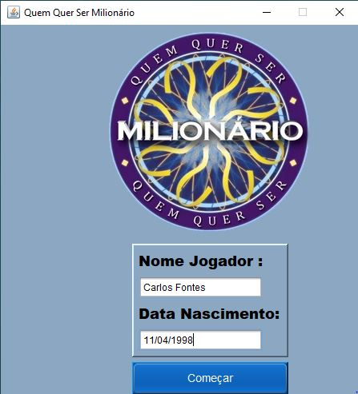
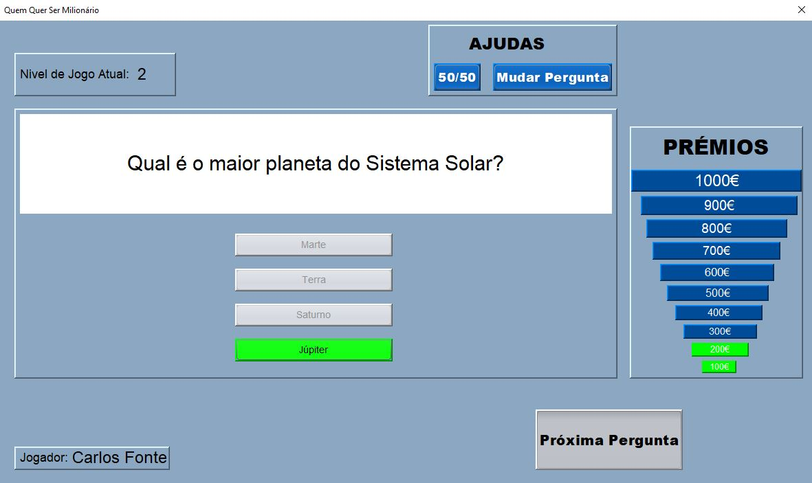
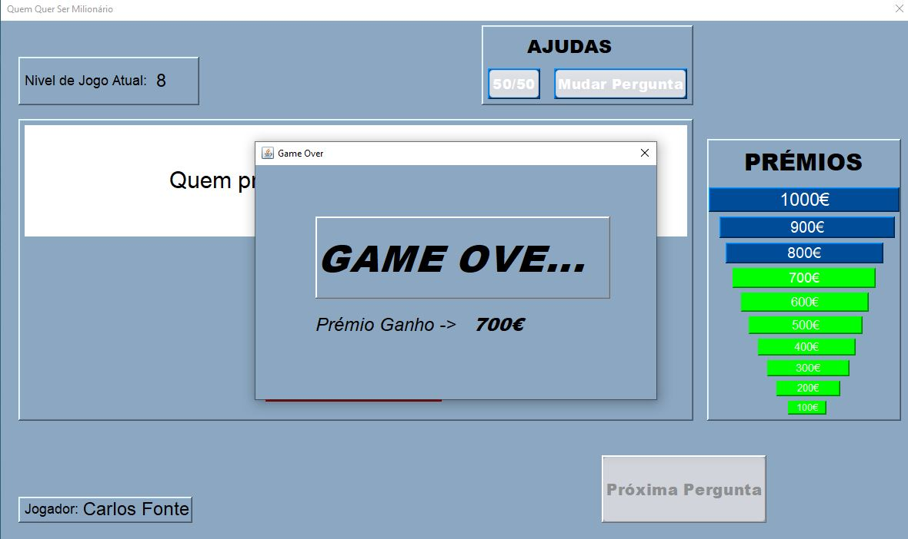

# 💰 Quem Quer Ser Milionário - Java Swing

Projeto desenvolvido no NetBeans que recria o famoso concurso de TV.

## 📸 Screenshots do Jogo

## 🚀 Como usar
Basta descarregar o projeto e abrir a pasta no NetBeans.
